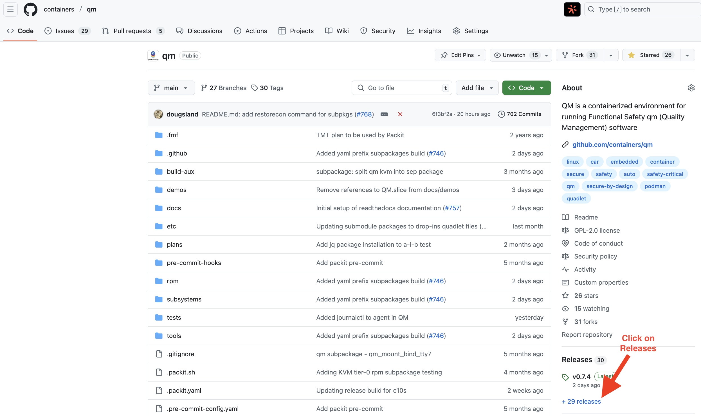
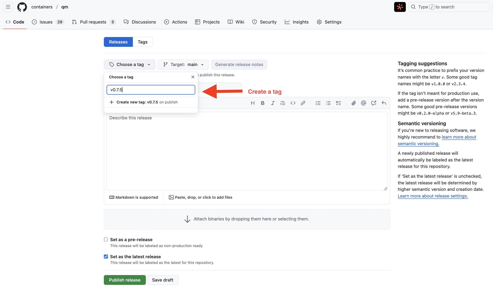
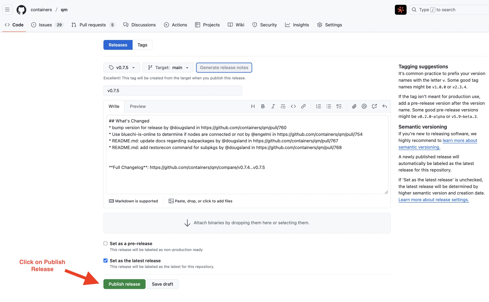

# Maintainer documentation

## Creating a new release

Initially, make sure to [bump **qm.te** and **VERSION** files in the git repo](https://github.com/containers/qm/pull/760) to the next release, i.e: *v0.7.5*.
After that, follow the steps below using GitHub UI.

**Create a new Release**

**Draft a new release**

**Create a new tag**

**Generate release notes**

**Publish Release**

