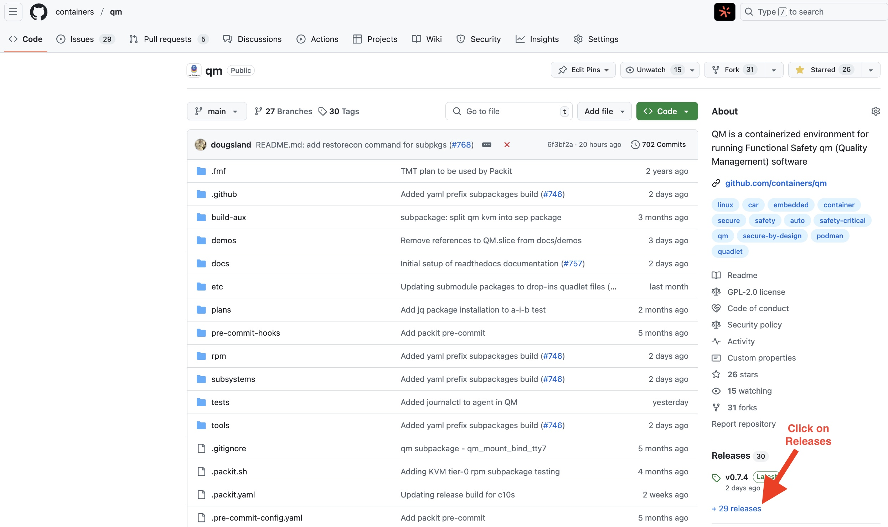
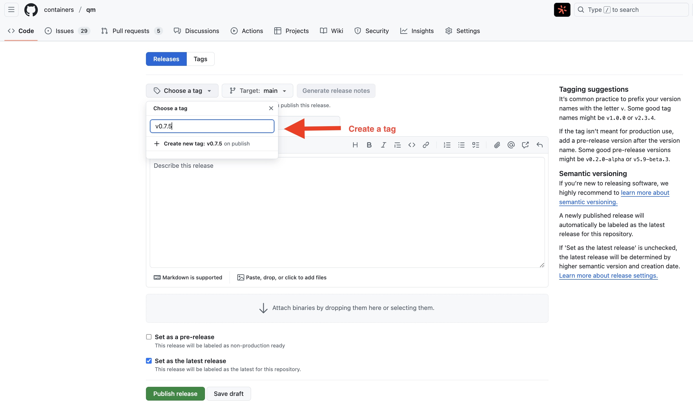
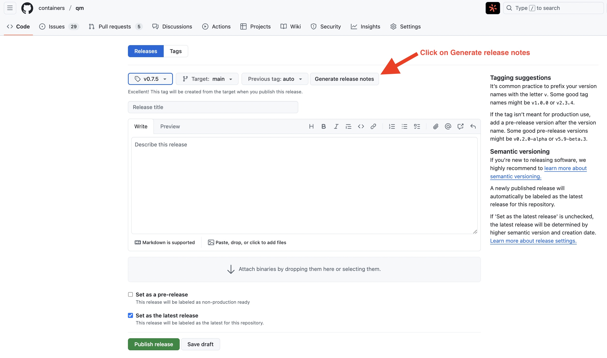
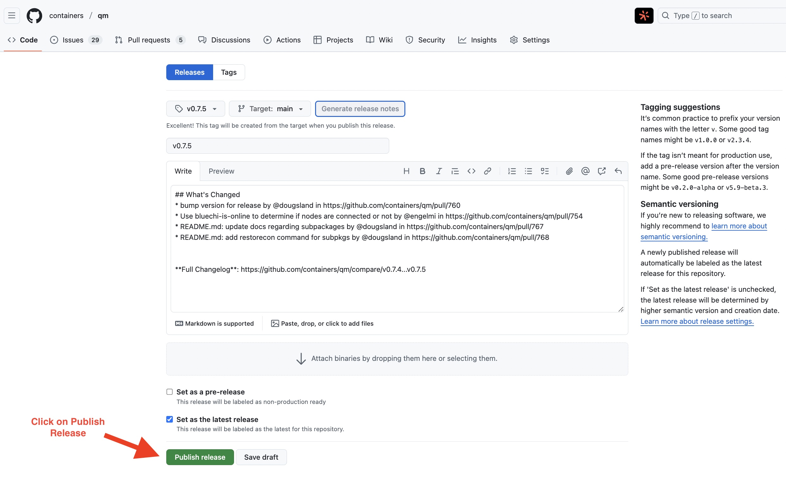

# Developers documentation

## Table of contents

- [Building QM rpm manually with changes](#building-qm-rpm-manually-with-changes)
- [Building CentOS AutoSD and QM manually](#building-centos-autosd-and-qm-manually)
- [Creating Releases](#creating-releases)
- [Subpackages](#subpackages)
- [Useful Commands](#useful-commands)
  - [Installing software inside QM partition](#installing-software-inside-qm-partition)
  - [Removing software inside QM partition](#removing-software-inside-qm-partition)
  - [Copying files to QM partition](#copying-files-to-qm-partition)
  - [Listing QM service](#listing-qm-service)
  - [List QM container via podman](#list-qm-container-via-podman)
  - [Extend QM quadlet managed by podman](#extend-qm-quadlet-managed-by-podman)
  - [Managing CPU usage](#managing-cpu-usage)
  - [Connecting to QM container via podman](#connecting-to-qm-container-via-podman)
  - [SSH guest CentOS Automotive Stream Distro](#ssh-guest-centos-automotive-stream-distro)
  - [Check if HOST and Container are using different network namespace](#check-if-host-and-container-are-using-different-network-namespace)
  - [Debugging with podman in QM using --root](#debugging-with-podman-in-qm)
  - [Creating your own drop-in QM sub-package](#creating-your-own-dropin-qm-subpackage)
  - [Install PR copr subpackages on local machine](#install-pr-copr-subpackages-on-local-machine)
  - [Debugging with quadlet](#debugging-with-quadlet)

## Building QM rpm manually with changes

Building QM locally with changes for tests is a recommended practice,
especially for testing new features before submitting a pull request.

**1.** Prerequisite

```bash
dnf install -y rpm-build golang-github-cpuguy83-md2man selinux-policy-devel
```

**2.** Clone the repo

```bash
git clone https://github.com/containers/qm.git && cd qm
```

**3.** Build the RPM

Select a QM version that is a higher number from the current one.
For example, if today's QM version is 0.6.2, set it to 1.0 so that
the RPM created is identifiable as yours.

```bash
make clean && VERSION=1.0 make rpm
```

The rpm is created at the `${RPM_TOPDIR}/RPMS` folder, by default
`${PWD}/rpmbuild/RPMS`.
You can export **RPM_TOPDIR** to change the path where the rpm will be placed.
For example:

```bash
VERSION=1.0 RPM_TOPDIR=/USER/rpmbuild make rpm
```

## Building CentOS AutoSD and QM manually

During development, it is common to conduct integration tests to ensure your
changes work well with other components within the overall solution.
In our case, it's best to test against the CentOS Automotive Stream
Distribution (AutoSD) image.

Once you have the new [RPM](#building-qm-rpm-manually-with-changes), follow these steps:

**1.** Make sure the new rpm is located in **/USER/rpmbuild/RPMS/**

Example

```bash
ls /root/rpmbuild/RPMS/noarch/qm-1.0-1.noarch.rpm
/root/rpmbuild/RPMS/noarch/qm-1.0-1.noarch.rpm
```

**2.** Download additional packages required by the image

```bash
sudo dnf download --destdir /root/rpmbuild/RPMS/noarch/ selinux-policy selinux-policy-any
```

**3.** Create a local repository with the new package

```bash
dnf install createrepo_c -y
cd /root/rpmbuild/RPMS/noarch/
createrepo .
```

**4.** Clone the CentOS Automotive distro for the build

Ensure you meet the requirements for the CentOS Automotive Stream by
referring to [this link](https://sigs.centos.org/automotive/building/).

The following commands will execute:

- Install the podman package
- Clone the sample-images repository and required submodules (automotive-image-builder)
- Cleanups before a fresh build
- Finally creates a new qcow2 image (BASED ON distro name, mode (ostree or regular) and uses the qemu-qm-container sample image)
  NOTE:
  - The path for the new QM rpm file (/root/rpmbuild/RPMS/noarch)
  - extra_rpms - useful for debug.
  - ssh enabled

The command below utilises automotive-image-builder to produce a `qm-minimal` qcow2 image for cs9,
other example images such as `simple-qm-container` and the `simple-qm`
image can be found in the images directory of the sample-images repository.

```bash
dnf install podman -y && dnf clean all
git clone https://gitlab.com/CentOS/automotive/sample-images.git
git submodule update --init
cd sample-images/
rm -rf _build #Optional, only relevant after initial build
rm -rf *.qcow2 #Optional, only relevant after initial build
./automotive-image-builder/automotive-image-builder build --distro cs9 --mode package --define 'ssh_permit_root_login=true' --define 'ssh_permit_password_auth=true' --define 'extra_repos=[{"id":"local","baseurl":"file:///root/rpmbuild/RPMS/noarch"}]' --define 'extra_rpms=["qm-1.0", "vim-enhanced", "openssh-server", "openssh-clients", "python3", "polkit", "rsync", "strace", "dnf", "gdb"]' --target qemu --export qcow2 images/qm-minimal.mpp.yml cs9-qemu-qm-container.x86_64.qcow2
```

If you would like more information on building automotive images with automotive-image-builder, please see the
[Automotive SIG pages for AutoSD](https://sigs.centos.org/automotive/getting-started/about-automotive-image-builder/)

Run the virtual machine, default user: root, pass: password.
To change default values, use the [defaults.ipp.yml](https://gitlab.com/CentOS/automotive/src/automotive-image-builder/-/blob/main/include/defaults.ipp.yml) file.

```bash
./automotive-image-builder/automotive-image-runner --nographics ./cs9-qemu-qm-container.x86_64.qcow2
```

## Creating Releases

Initially make sure to [bump **qm.te** and **VERSION** files in the git repo](https://github.com/containers/qm/pull/760) to the next release, i.e: *v0.7.5*.
After that, follow the steps below using GitHub UI.

**Create a new Release**


**Draft a new release**


**Create a new tag**


**Generate release notes**


**Publish Release**


## Subpackages

Subpackages are **experimental approach** to deliver in a single point (RPM) dropin files and additional requirements. [Click here for more information](experimental/SUBPACKAGES.md)

## Useful Commands

### Installing software inside QM partition

```bash
dnf --installroot /usr/lib/qm/rootfs/ install vim -y
```

### Removing software inside QM partition

```bash
dnf --installroot /usr/lib/qm/rootfs/ remove vim -y
```

### Copying files to QM partition

Please note: This process is only applicable for regular images.
OSTree images are read-only, and any files must be included during the build process.

Once this is understood, proceed by executing the following command on the host after
the QM package has been installed.

```bash
#host> cp file_to_be_copied /usr/lib/qm/rootfs/root
#host> podman exec -it qm bash
bash-5.1> ls /root
file_to_be_copied
```

### Listing QM service

```bash
[root@localhost ~]# systemctl status qm -l
● qm.service
     Loaded: loaded (/usr/share/containers/systemd/qm.container; generated)
     Active: active (running) since Sun 2024-04-28 22:12:28 UTC; 12s
ago
   Main PID: 354 (conmon)
      Tasks: 7 (limit: 7772)
     Memory: 82.1M (swap max: 0B)
        CPU: 945ms
     CGroup: /qm.service
             ├─libpod-payload-a83253ae278d7394cb38e975535590d71de90a41157b547040
4abd6311fd8cca
             │ ├─init.scope
             │ │ └─356 /sbin/init
             │ └─system.slice
             │   ├─bluechi-agent.service
             │   │ └─396 /usr/libexec/bluechi-agent
             │   ├─dbus-broker.service
             │   │ ├─399 /usr/bin/dbus-broker-launch --scope system
--audit
             │   │ └─401 dbus-broker --log 4 --controller 9 --machin
e-id a83253ae278d7394cb38e975535590d7 --max-bytes 536870912 --max-fds 4096 --max
-matches 16384 --audit
```

### List QM container via podman

```console
# podman ps
CONTAINER ID  IMAGE       COMMAND     CREATED         STATUS         PORTS       NAMES
a83253ae278d              /sbin/init  38 seconds ago  Up 38 seconds              qm
```

### Extend QM quadlet managed by podman

QM quadlet file is shipped through rpm, refer the following file.
qm.container which is installed to /usr/share/containers/systemd/qm.container
Please refer `man quadlet` for the supported value and how to.

In case a change needed in quadlet file, do not update systemd/qm.container file
As per `man quadlet` do the following:

```console
if ! test -e /etc/containers/systemd/qm.container.d ; then
  mkdir -p  /etc/containers/systemd/qm.container.d
fi
cat > "/etc/containers/systemd/qm.container.d/expose-dev.conf" <<EOF
[Container]
# Expose host device /dev/net/tun
AddDevice=-/dev/net/tun
# In case parameter override needed, add empty value before the required key
Unmask=
Unmask=ALL
EOF
```

To verify the result use the following command:

```console
/usr/lib/systemd/system-generators/podman-system-generator  --dryrun
```

Once the result is satisfied, apply the following

```console
systemctl daemon-reload
systemctl restart qm
systemctl is-active qm
active
```

### Managing CPU usage

Using the steps below, it's possible to manage CPU usage of the `qm.service` by modifying service attributes and utilizing drop-in files.

#### Setting the CPUWeight attribute

Modifying the `CPUWeight` attribute affects the priority the of `qm.service`. A higher value prioritizes the service, while a lower value deprioritizes it.

Inspect the current CPUWeight value:

```bash
systemctl show -p CPUWeight qm.service
```

Set the CPUWeight value:

```bash
systemctl set-property qm.service CPUWeight=500
```

#### Limiting CPUQuota

It's also possible to limit the percentage of the CPU allocated to the `qm.service` by defining `CPUQuota`. The percentage specifies how much CPU time the unit shall get at maximum, relative to the total CPU time available on one CPU.

Inspect the current `CPUQuota` value via the `CPUQuotaPerSecUSec` property:

```bash
systemctl show -p CPUQuotaPerSecUSec qm.service
```

Set the `CPUQuota` value of `qm.service` on the host using:

```bash
systemctl set-property qm.service CPUQuota=50%
```

Verify the `CPUQuota` drop in file has been created using the command below.

```bash
systemctl show qm.service | grep "DropInPath"
```

Expected output:

```bash
DropInPaths=/usr/lib/systemd/system/service.d/10-timeout-abort.conf /etc/systemd/system.control/qm.service.d/50-CPUQuota.conf
```

To test maxing out CPU usage and then inspect using the `top` command, follow these steps:

- Set the `CPUQuota` value of `qm.service` on the host using:

```bash
systemctl set-property qm.service CPUQuota=50%
```

- Execute this command to stress the CPU for 30 seconds:

```bash
podman exec qm timeout 30 dd if=/dev/zero of=/dev/null
```

- Observe the limited CPU consumption from the `qm.service`, as shown in the output of the command below:

```bash
top | head
```

Expected output:

```bash
    PID USER      PR  NI    VIRT    RES    SHR S  %CPU  %MEM     TIME+ COMMAND
1213867 root      20   0    2600   1528   1528 R  50.0   0.0   4:15.21 dd
   3471 user      20   0  455124   7568   6492 S   8.3   0.0   1:43.64 ibus-en+
      1 root      20   0   65576  37904  11116 S   0.0   0.1   0:40.00 systemd
```

### Connecting to QM container via podman

```console
# podman exec -it qm bash
bash-5.1#
```

### SSH guest CentOS Automotive Stream Distro

Make sure the CentOS Automotive Stream Distro Virtual Machine/Container is running with SSHD enabled
and permits ssh connection from root user.

Add **PermitRootLogin yes** into **sshd_config**

```bash
host> vi /etc/ssh/sshd_config
```

Restart systemctl restart sshd

```bash
host> systemctl restart sshd
```

Find the port the ssh is listening in the VM

```bash
host> netstat -na |more # Locate the port (2222 or 2223, etc)
```

Example connecting from the terminal to the Virtual Machine:

```bash
connect-to-VM-via-SSH> ssh root@127.0.0.1 \
    -p 2222 \
    -oStrictHostKeyChecking=no \
    -oUserKnownHostsFile=/dev/null
```

### Check if HOST and Container are using different network namespace

#### HOST

```console
[root@localhost ~]# ls -l /proc/self/ns/net
lrwxrwxrwx. 1 root root 0 May  1 04:33 /proc/self/ns/net -> 'net:[4026531840]'
```

#### QM

```console
bash-5.1# ls -l /proc/self/ns/net
lrwxrwxrwx. 1 root root 0 May  1 04:33 /proc/self/ns/net -> 'net:[4026532287]'
```

### Debugging with podman in QM

```console
bash-5.1# podman --root /usr/share/containers/storage pull alpine
Error: creating runtime static files directory "/usr/share/containers/storage/libpod":
mkdir /usr/share/containers/storage: read-only file system
```

### Creating your own dropin QM subpackage

We recommend using the existing drop-in files as a guide and adapting them to your specific needs. However, here are the step-by-step instructions:

1) Create a drop-in file in the directory: `etc/qm/containers/containers.conf.d/`
2) Add it as a sub-package to `rpm/<subpackage>.spec`
3) Test it by running: `make clean && make TARGETS=<subpackage> subpackages`
4) Additionally, test it with and without enabling the sub-package using (by default it should be disabled but there are cases where it will be enabled by default if QM community decide):

Example changing the spec and triggering the build via make (feel free to automate via sed, awk etc):

```bash
# Use make file to run specific subpackage
make TARGETS=windowmanager subpackages

```

Check rpms created in PT Actions under PR Checks > Packit-as-a-Service
In case new tests need the sub-package, it will be installed immediatly
on Packit-as-a-Service test phase.

### Install PR copr subpackages on local machine

1. Enable repo in your machine
This part is done automatically by TestingFarm guest provisioning.
In case of manual installation,

```bash
dnf copr enable packit/containers-qm-<PR_ID> <distro><arch>
```

1. Install rpm in qm
This part is done automatically by TestingFarm guest provisioning.
In case of manual installation,

```bash
podman cp /etc/yum.repos.d/_copr:copr.fedorainfracloud.org:packit:containers-qm-<PR_ID>.repo qm:/etc/yum.repos.d/

dnf  install --releasever=<VERSION_ID> --installroot /usr/lib/qm/rootfs/ <package>
```

### Debugging with quadlet

Imagine a situation where you have a Quadlet container inside QM that isn't starting, and you're unsure why. The best approach is to log into the QM, run the ```quadlet --dryrun``` command, and analyze what's happening. Here's how you can troubleshoot the issue step by step.

```bash
$ sudo podman exec -it qm bash
bash-5.1# cd /etc/containers/systemd/
bash-5.1# ls
ros2.container

bash-5.1# /usr/libexec/podman/quadlet --dryrun
quadlet-generator[1068]: Loading source unit file /etc/containers/systemd/ros2.container
quadlet-generator[1068]: converting "ros2.container": unsupported key 'Command' in group 'Container' in /etc/containers/systemd/ros2.container
bash-5.1#
```

As you can see above, the error occurs because the Quadlet is attempting to use an unsupported key from the Service section in the Container group. Removing the unsupported key ```Command``` from ```ros2.container``` and then reloading or restarting the service should resolve the issue.
